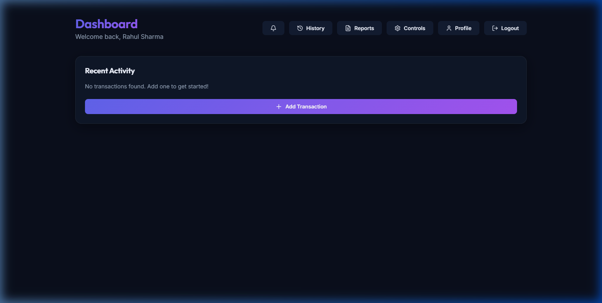
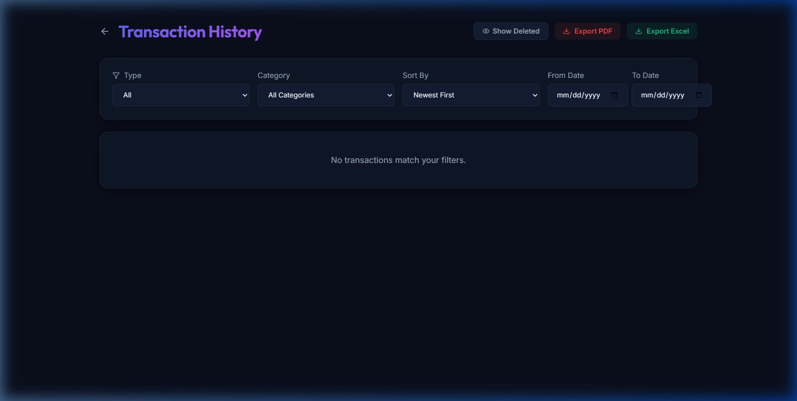
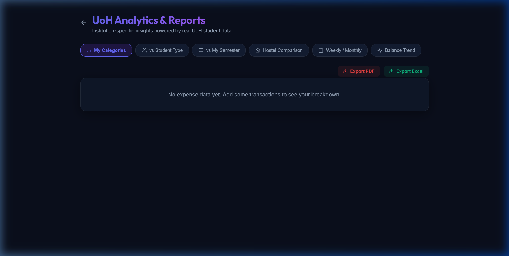

# Student Expense Tracker (Anti Gravity)

A comprehensive web-based expense tracker designed for students to manage their finances, track income and expenses, and gain insights into their spending habits.

## 🚀 Features

- **User Management**: Registration and login with student-specific profiles (hosteller/day scholar, hostel name, semester).
- **Transaction Tracking**: Log income and expenses with categories and descriptions.
- **Budgeting**: Set weekly and monthly budgets with alert thresholds.
- **Analytics & Reports**: Visual summaries of spending patterns, hostel-wise comparisons, and export options (PDF/Excel).
- **Recurring Bills**: Manage recurring payments like mess dues and semester fees.
- **Notifications**: Stay updated with budget alerts and bill reminders.

## 🛠️ Technology Stack

- **Frontend**: React, TypeScript, Tailwind CSS (or Vanilla CSS), Recharts, Lucide React.
- **Backend**: Node.js, Express.js.
- **Database**: MySQL with Sequelize ORM.
- **Authentication**: JWT (JSON Web Token).

## 📸 UI Screenshots

### Dashboard


### Transaction History


### Analytics & Reports


## 🏗️ Project Structure

```text
.
├── backend/            # Express.js API
├── frontend/           # React Frontend
├── schema_ddl.sql      # Database Schema
├── seed_dml.sql        # Sample Data
└── requirements.md     # Detailed Requirements
```

## 🚦 Getting Started

### Prerequisites

- Node.js (v16+)
- MySQL Server

### Database Setup

1. Create a MySQL database named `expense_tracker`.
2. Configure the database credentials in `backend/.env`.
3. Run the initialization script:
   ```bash
   cd backend
   node execute_sql.js
   ```

### Running the Application

1. **Start the Backend**:
   ```bash
   cd backend
   npm install
   npm run dev
   ```

2. **Start the Frontend**:
   ```bash
   cd frontend
   npm install
   npm start
   ```

3. Open [http://localhost:3000](http://localhost:3000) in your browser.

## 📄 License

This project is licensed under the MIT License.
